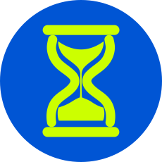
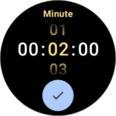
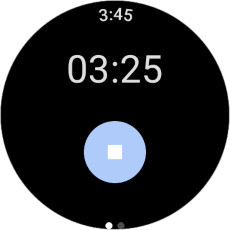
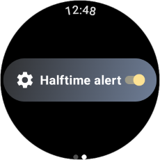
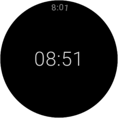
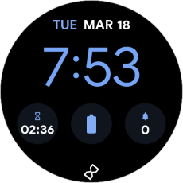

# **Silent Timer**
A lightweight **Wear OS** timer app designed for silent operation — vibrates without ringing.



## **📌 Features**
 ✅ **Silent**: Vibrates instead of ringing.<br>
 ✅ **Halftime alert**: Option to buzz briefly at halftime.<br>
 ✅ **Ambient mode**: Supports countdown in ambient mode.<br>
 ✅ **Complication**: Includes a watchface complication.<br>
 ✅ **Minimalist UI**: Designed for Wear OS with a simple interface.<br>

## **🌌 Background**
I developed this app for personal use because of features I missed in the default Pixel Watch 
timer app. The goal is to keep it simple and similar to the default timer. Features I
wanted in my timer app:
- Silent operation: Vibrate without ringing when the timer expires.
- Halfway alert: Brief reminder when the timer is halfway (e.g. for cooking).
- Ambient mode: See the countdown when the watch is in ambient mode.

## **🔧 Supported Versions**
The app currently supports Wear OS 4.0 and above, with Wear OS 5.1 as its main target.

## **📸 Screenshots**
### Timer setup

### Timer display

### Timer settings

### Timer display (ambient mode)

### Timer complication and ongoing activity


## **🚀 Installation**
There are two ways to install the app on the device:
1. Join the beta test to download it directly from the Google Play Store.
2. Sideload it on the device.

### Google Play Store beta test
- Join the Google group to be automatically added to the testers list: https://groups.google.com/g/closed-testing-silent-timer
- Join the beta: https://play.google.com/apps/testing/com.github.vmsteiner.silenttimer
- When installing the app be sure to select your watch as the target device (and not your phone, or you will get an error)

### Sideloading 

The sideloading guide below is based on a Pixel Watch 2 running Wear OS 5.1 and a Windows PC.

#### **Step 1: Download the app**
- Download the prebuild APK file from releases (or build it yourself)

#### **Step 2: Prepare the watch**
- Open Settings
- Tap System > About > Versions
- Tap the Build number seven times to enable developer options
- Go back to Settings
- Tap Developer options
- Enable "ADB debugging"

#### **Step 3: Download ADB on your PC**
- Download the [SDK Platform Tools](https://developer.android.com/tools/releases/platform-tools) provided by Google
- Extract the .zip

#### **Step 4: Connect the watch to PC**
- Connect the watch charger to a USB-C port from your PC (Pixel Watch 2 and up)
- Put your watch on the charger and unlock it with PIN
- A pop-up should appear "Allow Debugging". Select **OK**. 
- (If no Pop-Up appears disable and enable "ADB debugging" from Step 2 while connected to the PC)

#### **Step 5: Transfer app to watch**
- Open a Terminal in the folder where you extracted the SDK Platform Tools in Step 3
- Run the following command: ```.\adb install "Path\to\the\downloaded\silenttimer.apk"```
- Success🎉🎉
- Disconnect the watch from PC

#### **Clean-Up (if required)**
- Disable "ADB debugging" from step 2
- Delete the .zip and the extracted folder from step 3

## **🚀 Development**

### **📂 Project Structure**
```
📦 silenttimer
┣ 📂 presentation
┃ ┣ 📂 service           # Timer and complication services
┃ ┣ 📂 theme             # App-wide theming and styles
┃ ┣ 📂 ui                # UI Screens (Timer Setup, Timer Display)
┃ ┣ 📂 utils             # Utility functions (e.g. time formatting)
┃ ┣ 📂 viewmodel         # ViewModels for state management
┃ ┗ 📜 TimerApp.kt       # Application class for global setup
┣ 📜 Navigation.kt       # Handles app navigation
```  

## **📝 Code Overview**

### **🔹 `TimerApp.kt`**
- Ensures **global setup** before any component (like activities or services) is created.
- Creates a **notification channel** for timer-related notifications used throughout the app.

### **🔹 `MainActivity.kt`**
- The **entry point** of the app.
- Requests **permissions** and updates **complications** on launch.
- Sets up the **Wear OS Material Theme**.

### **🔹 `Navigation.kt`**
Handles **screen navigation** using `SwipeDismissableNavHost`. Automatically switches between:
- `TimerSetupScreen` (when timer is inactive)
- `TimerDisplayScreen` (when timer is running)

### **🔹 `TimerSetupScreen.kt`**
- Lets users **select** a countdown time.
- Starts the **TimerService** when confirmed.

### **🔹 `TimerDisplayScreen.kt`**
- Shows the remaining time.
- Allows stopping the timer.
- Has a horizontal page to access the settings
- Supports **Wear OS Ambient Mode** for low-power display.

### **🔹 `TimerService.kt`**
- Runs a **foreground service** to handle the countdown.
- Manages **wake locks** to prevent sleep mode.
- Handles **vibration alerts** when the timer reaches zero.
- Updates **watchface complications** when timer state changes.

### **🔹 `TimerComplicationDataSourceService.kt`**
- Provides a **Wear OS complication** for the countdown timer.
- Displays **remaining time** directly on supported watch faces.

### **🔹 `CountdownManager.kt`**
- Manages the **countdown timer state** using `StateFlow`.
- Keeps track of **time remaining** for UI and complications.

### **🔹 `TimerStateManager.kt`**
- A **singleton** managing timer state using `StateFlow`.
- Keeps track of whether the timer is active or not.

### **🔹 `TimerSetupViewModel.kt`**
- Stores the **selected countdown time** before starting the timer.

### **🔹 `Utils.kt`**
- Contains helper functions, including **time formatting**.

### **🔹 `Settings.kt`**
- Manages application-level **settings** using Jetpack DataStore.

### **🔹 `SilentTimerTheme.kt`**
- Defines the **Wear OS Material Theme** for consistent styling.

### **🔹 `AndroidManifest.xml`**
- Declares **permissions**, **services** and the app’s **entry points**.

## **📜 License**
GNU General Public License v3.0

## **🤝 Contributing**
Want to contribute? Pull requests and issues are welcome! 🎉

## **📚 Dependencies**
[Google Horologist](https://github.com/google/horologist): Used for the TimePicker and AmbientAware Composables.

